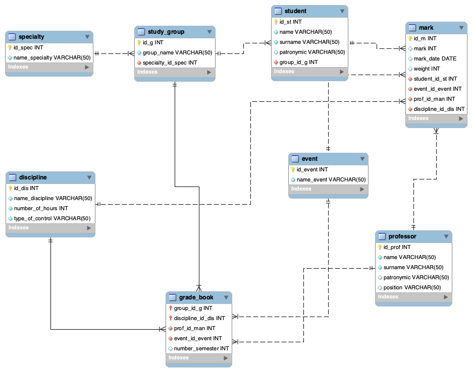

# База данных для учета успеваемости студентов

Этот репозиторий содержит базу данных, предназначенную для ведения учета успеваемости студентов. Включает SQL-скрипты для создания и заполнения базы, ER-диаграмму и примеры запросов для экспорта данных.

## Содержание
1. [Описание базы данных. Техническое и принципиальное задания](#описание-базы-данных-техническое-и-принципиальное-задания)
2. [Структура базы данных](#структура-базы-данных)
3. [ER-диаграмма](#er-диаграмма)
4. [Создание и наполнение базы данных](#создание-и-наполнение-базы-данных)
5. [Примеры 3-х SQL-запросов к базе данных](#примеры-3-х-sql-запросов-к-базе-данных)

## Описание базы данных. Техническое и принципиальное задания
База данных предназначена для учета успеваемости студентов. Она позволяет:
- Хранить информацию о студентах, предметах, преподавателях и оценках.
- Анализировать успеваемость по различным критериям.
- Экспортировать данные для дальнейшей обработки: начисления повышенной стипендии, отслеживания недопущенных к аттестации.
  
  [Техническое задание](./путь/к/файлу.pdf)
  
  [Принципиальное задание](./путь/к/файлу.pdf)

## Структура базы данных
Основные таблицы базы данных:
- **`Specialty`** - перечень направлений, на которых обучаются студенты
- **`Discipline`** - перечень учебных предметов
- **`Event`** - перечень видов контрольных мероприятий: зачет, курсовая...
- **`Professor`** - информация о преподавателях
- **`Study_group`** - информация о номере учебной группы и ее специальности
- **`Student`** - информация о студентах (ID, ФИО, группа)
- **`Grade_book`** - журнал успеваемости с указанием изучаемой дисциплины, преподавателя, вида контрольного мероприятия и группы 
- **`Mark`** - оценки студентов по дисциплинам и событиям

## ER-диаграмма


## Создание и наполнение базы данных
Ниже представлен SQL-запрос на создание базы данных успеваемости студентов.

[SQL-запрос на создание базы данных](создание_модели_бд.sql)

```sql
-- Пример SQL-дампа для создания таблицы specialty и discipline
CREATE TABLE specialty (
    id_spec          INT NOT NULL PRIMARY KEY,
    name_specialty   VARCHAR(50) NOT NULL
);

CREATE TABLE discipline (
    id_dis            INT NOT NULL PRIMARY KEY,
    name_discipline   VARCHAR(50) NOT NULL,
    number_of_hours   INT NOT NULL,
    type_of_control   VARCHAR(50) NOT NULL
);
```

Для тестового наполнения были сгенерирован следующий пакет данных:

[SQL-запрос на наполнение базы данных](наполнение_бд.sql)

```sql
-- Пример заполнения таблицы professor
INSERT INTO professor (id_prof, name, surname, patronymic, position) VALUES
(1, 'Иван', 'Петров', 'Сергеевич', 'Профессор'),
(2, 'Мария', 'Сидорова', 'Александровна', 'Доцент'),
(3, 'Алексей', 'Иванов', 'Дмитриевич', 'Старший преподаватель'),
(4, 'Елена', 'Кузнецова', 'Владимировна', 'Ассистент'),
(5, 'Дмитрий', 'Смирнов', 'Олегович', 'Профессор'),
(6, 'Ольга', 'Васильева', 'Игоревна', 'Доцент');
```

## Примеры 3-х SQL-запросов к базе данных
Проиллюстрируем работу информационной системы на примере 3-х SQL-запросов.

1. Создание списка студентов всех групп и направлений с сортировкой от самых успешных к наименее успешным для формирования списка студентов с повышенной стипендией. Сортировка списка студентов по фамилии в алфавитном порядке.

[Запрос_1](запрос_1.sql)

[Файл таблицы по запросу1](запрос_1.csv)

Фрагмент вывода таблицы:
```csv
"ID студента",Студент,Группа,Направление,"Количество оценок","Средний балл","Количество пятерок","Количество двоек"
4,"Лебедева Ольга Андреевна",ПМ-201,"Прикладная математика",3,5.00,3,0
8,"Павлова Наталья Викторовна",ИВТ-102,"Информатика и вычислительная техника",2,5.00,2,0
1,"Смирнов Александр Алексеевич",ИВТ-101,"Информатика и вычислительная техника",4,5.00,4,0
9,"Кузнецов Сергей Дмитриевич",ПМ-201,"Прикладная математика",2,4.00,0,0
```

2. Создание списка студентов, имеющих оценки 2 и 3 за любые виды контрольных мероприятий с указанием преподавателя, поставившего оценку, специализации и номера группы для формирования списка недопущенных к аттестации.

[Запрос_2](запрос_2.sql)

[Файл таблицы по запросу2](запрос_2.csv)

Фрагмент вывода таблицы:
```csv
Студент,Специализация,Группа,Дисциплина,"Вид мероприятия",Оценка,Преподаватель,"Дата оценки"
"Федоров Артем",Лингвистика,ЛГ-501,"Иностранный язык",Зачет,2,"Васильева Ольга",2023-12-12
"Федоров Артем",Лингвистика,ЛГ-501,"Иностранный язык","Курсовая защита",2,"Васильева Ольга",2024-05-12
"Федоров Артем",Лингвистика,ЛГ-501,"Иностранный язык",Зачет,2,"Васильева Ольга",2024-12-12
"Волков Дмитрий","Информатика и вычислительная техника",ИВТ-102,"Математический анализ",Лекция,3,"Петров Иван",2023-09-20
```

3. Создание списка дисциплин и групп, которым преподаются дисциплины, для для демонстрации академической нагрузки преподавателей.
   
[Запрос_3](запрос_4.sql)

[Файл таблицы по запросу3](запрос_4.csv)

Фрагмент вывода таблицы:
```csv
professor_name,"Количество дисциплин","Количество групп"
"Петров Иван Сергеевич",1,2
"Сидорова Мария Александровна",3,2
"Иванов Алексей Дмитриевич",1,2
"Кузнецова Елена Владимировна",1,1
"Смирнов Дмитрий Олегович",2,2
"Васильева Ольга Игоревна",1,1
```
